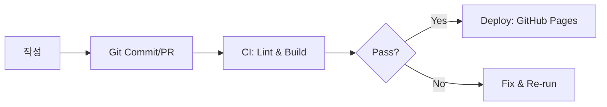

# Docs-as-Code란?

**문서를 코드처럼 다룬다**는 접근입니다.  
Git으로 버전 관리하고, PR 리뷰로 품질을 올리고, CI로 배포·검사를 자동화합니다.

## 왜 좋은가요?
- **재현성**: 모든 변경 이력/리뷰가 남습니다.
- **자동화**: 린트·링크체크·빌드가 자동으로 수행됩니다.
- **협업성**: 코드 리뷰와 동일한 흐름으로 문서를 개선합니다.
