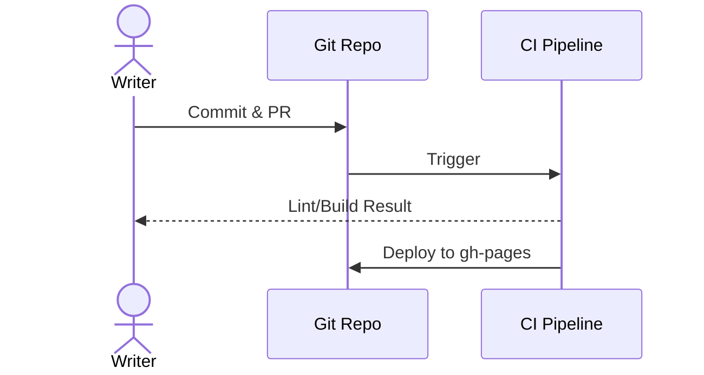

# Hello Docs-as-Code 튜토리얼

아래 순서를 그대로 따라 하시면 **로컬 미리보기 → 린트 → GitHub Pages 배포**까지 완료됩니다.

## 0) 사전 준비
- **Git**, **Python 3.10+**
- (선택) **Node.js 18+** — 마크다운 린트를 쓰실 경우
- (선택) **Vale** — 문체 검사 도구

!!! tip "설치 팁"
    - macOS: `brew install git python vale node`
    - Windows: Python(공식 설치자), Git, Node 설치 후 Vale는 `winget install Vale.Vale`

## 1) 리포지터리 초기화
```bash
git init
git add .
git commit -m "chore: bootstrap docs-as-code starter"
```

## 2) MkDocs(Material) 설치 및 미리보기
```bash
python -m venv .venv
# macOS/Linux
. ./.venv/bin/activate
# Windows PowerShell
# .\.venv\Scripts\Activate.ps1

pip install mkdocs mkdocs-material
mkdocs serve -a 0.0.0.0:8000
```
브라우저 `http://localhost:8000` → 좌측 네비게이션이 보이면 성공입니다.

## 3) 문서 편집 규칙 적용
### 3-1) markdownlint (Node)
```bash
npm init -y
npm i -D markdownlint-cli2
npx markdownlint-cli2 **/*.md
```

### 3-2) Vale (문체 검사)
- macOS: `brew install vale`
- Windows: `winget install Vale.Vale`
```bash
vale --version
vale docs/
```

## 4) GitHub Actions로 CI 구성
`.github/workflows/docs.yml`에 포함된 워크플로는 아래를 수행합니다.
1. **Lint**: markdownlint + Vale
2. **Build**: MkDocs 엄격 빌드(`--strict`)
3. **Deploy**: `gh-pages` 브랜치로 정적 사이트 배포

푸시 후, GitHub ▸ Settings ▸ Pages에서 Branch를 `gh-pages`로 설정하세요.

## 5) Mermaid 다이어그램 테스트


## 6) 다음 단계
- `docs/style-guide/glossary.md`에 팀 용어 정의
- PR 템플릿과 리뷰 체크리스트 확장
- 실제 프로젝트 문서로 교체/이관
